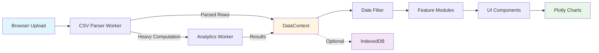
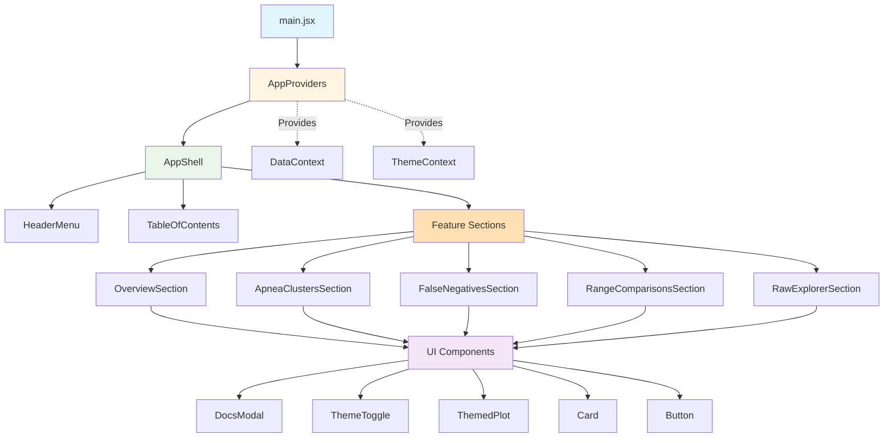
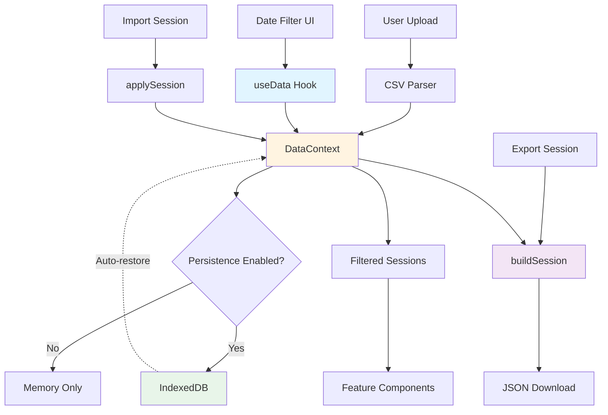

## Architecture

At heart the analyzer is a single‑page application powered by [React](https://react.dev/) and bundled with
[Vite](https://vitejs.dev/). The architecture favors plain functions and composable building blocks over heavy
framework abstractions. This section peels back the layers so you can orient yourself before diving into the source.

### High‑Level Flow

The following diagram shows how data flows through the analyzer from initial upload to rendered visualizations:



**Flow breakdown:**

1. **Entry Point** – `main.jsx` bootstraps the React app and mounts `<AppProviders><AppShell /></AppProviders>` inside a
   root DOM node. `AppProviders` centralizes shared hooks, modals, and the CSV/session state machine so feature code can
   assume those contexts already exist. Vite handles module loading and hot replacement during development.
2. **File Upload** – `useAppState` (in `src/app/useAppState.js`) hosts the CSV upload handlers. When a file is chosen, a
   dedicated parser worker filters events, converts timestamps, and streams batches with per-chunk progress updates via
   `postMessage` so the main thread receives only necessary data and remains responsive. Analysis sections render only
   after at least one row arrives, preventing charts from initializing with empty data.
3. **Context Store** – `AppProviders` wraps the tree with `DataProvider` to expose parsed rows and filtered subsets via
   hooks like `useData`, `useParameters`, and `useTheme`. Using context keeps props shallow and makes it easy to expose
   new pieces of state without threading them through every component.

**Example: Web Worker Message Passing**

When offloading heavy computation to a worker (e.g., clustering algorithms), use this pattern:

```javascript
// In main thread (e.g., useAnalyticsProcessing.js):
const worker = new Worker(
  new URL('../workers/analytics.worker.js', import.meta.url),
  { type: 'module' },
);

// Send work to background thread
worker.postMessage({
  type: 'cluster-apneas',
  events: filteredDetails,
  params: { algorithm: 'kmeans', k: 3 },
});

// Handle results
worker.onmessage = (e) => {
  if (e.data.type === 'cluster-result') {
    setClusters(e.data.clusters);
  }
};

// In worker (analytics.worker.js):
self.onmessage = (e) => {
  if (e.data.type === 'cluster-apneas') {
    const clusters = performClustering(e.data.events, e.data.params);
    self.postMessage({ type: 'cluster-result', clusters });
  }
};
```

**Worker Best Practices:**

- Use structured messages with `type` field for clarity
- Keep worker logic pure: input → computation → output (no DOM access)
- Post progress updates for long operations: `self.postMessage({ type: 'progress', percent: 50 })`
- Terminate workers when unmounting components: `worker.terminate()`
- **Date Serialization**: Always convert Date/DateTime objects to milliseconds (number) before postMessage

**Date Serialization Strategy:**

The structured clone algorithm used by `postMessage` cannot serialize `Date` objects or Luxon `DateTime` instances.
All date values sent from workers to the main thread must be converted to milliseconds (primitive numbers):

```javascript
// In worker: Convert DateTime to milliseconds before sending
const processed = rows.map((r) => {
  if (r['DateTime']) {
    const ms = new Date(r['DateTime']).getTime();
    return { ...r, DateTime: ms };
  }
  return r;
});
self.postMessage({ type: 'rows', rows: processed });

// In main thread: Reconstruct Date/DateTime from milliseconds
worker.onmessage = (e) => {
  if (e.data.type === 'rows') {
    const rows = e.data.rows.map((r) => ({
      ...r,
      DateTime: new Date(r.DateTime), // or DateTime.fromMillis(r.DateTime)
    }));
    setData(rows);
  }
};
```

**Why milliseconds?**

- Milliseconds are primitive numbers that serialize reliably via structured cloning
- Directly compatible with `new Date(ms)` and Luxon's `DateTime.fromMillis(ms)`
- More efficient than ISO 8601 strings, which require parsing on every receive

**Alternatives considered:**

- **ISO 8601 strings**: Would serialize but add parsing overhead for every row received
- **Custom serialization**: Would require maintaining a bidirectional serialization protocol
- **Milliseconds** (chosen): Optimal balance of simplicity, performance, and compatibility

**CRITICAL**: When refactoring worker message passing, preserve this DateTime-to-milliseconds pattern.
Do not attempt to send Date or DateTime objects directly—they will be received as empty objects `{}`.

**See Also**: [src/workers/](../../src/workers/), [src/hooks/useAnalyticsProcessing.js](../../src/hooks/useAnalyticsProcessing.js), [Structured Clone Algorithm](https://developer.mozilla.org/en-US/docs/Web/API/Web_Workers_API/Structured_clone_algorithm) 4. **Visualization Components** – Each feature now lives in `src/features/<feature>/`, which bundles the `Section`
container, local components, and colocated tests. The directory exposes a public API through `index.js` so the rest of
the app imports `import { OverviewSection } from '@features/overview'` style entry points. Sections pull shared
primitives (cards, modals, themed charts, etc.) from `src/components/ui`, keeping feature modules focused on
domain-specific behavior while UI atoms stay reusable. 5. **Workers for Heavy Lifting** – Beyond CSV parsing, dedicated workers perform computationally expensive tasks such as
k‑means clustering of apnea events and detection of likely false negatives. Offloading work keeps the UI snappy even
with multi‑year datasets.

### Component Structure

The component hierarchy follows a clear top-down pattern:



**Component roles:**

`App.jsx` now exports `AppShell`, a lightweight composition layer that wires the header layout, table-of-contents, and
feature sections together. Sidebar links still set an "active view" state, but the heavy lifting is handled inside the
feature modules so `AppShell` stays thin. This keeps the bundle small without introducing a routing library for what is
still a tabbed interface.

Feature directories encapsulate their logic: `src/features/overview/` hosts the dashboard cards and tests, while
`src/features/apnea-clusters/` contains both the cluster analysis view and the reusable parameter metadata it exports for
tests. Shared primitives (buttons, cards, modals, themed Plotly wrappers, etc.) now live under `src/components/ui/` with
an `index.js` barrel so consumers can `import { DocsModal, ThemeToggle } from '@ui'`. Higher-level analytics widgets such
as `UsagePatternsCharts` remain in `src/components/`, but they depend on UI atoms through that barrel, keeping imports
consistent across the codebase.

An `ErrorBoundary` from `react-error-boundary` wraps most charts. Should a render error occur—perhaps due to malformed
data or a Plotly regression—the boundary displays a friendly message rather than crashing the entire app. The error is
also logged to the console for debugging.

### Using DataContext

Access session data, filters, and theme settings in any component via the `useData()` hook:

```jsx
import { useData } from '../context/DataContext';

export default function MyAnalysis() {
  // Access all parsed data and filtered subsets
  const {
    summaryData, // All Summary CSV rows
    detailsData, // All Details CSV rows (event-level)
    filteredSummary, // Summary rows within active date range
    filteredDetails, // Details rows within active date range
    theme, // Current theme: 'system' | 'light' | 'dark'
    setTheme, // Function to update theme
  } = useData();

  // Compute metrics from filtered data
  const avgAHI = filteredSummary?.length
    ? filteredSummary.reduce((sum, row) => sum + (row.AHI || 0), 0) /
      filteredSummary.length
    : 0;

  return (
    <div>
      <p>Showing {filteredSummary?.length || 0} nights</p>
      <p>Average AHI: {avgAHI.toFixed(2)} events/hour</p>
    </div>
  );
}
```

**Key Patterns:**

- Always use `filteredSummary` and `filteredDetails` for user-visible calculations—these respect date range filters
- Check for null/undefined: data is `null` until CSV files are uploaded
- Use optional chaining (`?.`) to handle empty states gracefully
- `summaryData` and `detailsData` contain the full dataset; use for computing global statistics

**See Also**: [src/context/DataContext.jsx](../../src/context/DataContext.jsx)

---

### State and Persistence

State management flows through several layers, with clear separation between UI state and data state:



**State flow:**

`DataContext` combines several concerns:

- Parsed CSV rows
- User‑selected date ranges
- Theme (light, dark, or system)
- Session persistence flags

The `useSessionManager` hook serializes this state to `IndexedDB` using the browser's `idb` wrapper when "Remember data
locally" is enabled. Sessions can be saved, loaded, or cleared via controls in the header. Disabling persistence immediately
removes the stored session to avoid stale data. Exporting a session produces JSON that can be imported on another machine;
sensitive personal notes are intentionally excluded.

### Styling and Themes

The project uses a single `guide.css` file for global styles plus small component‑scoped CSS modules where necessary.
Color choices aim for WCAG AA contrast, and the `ThemeToggle` component flips between palettes. Plotly charts adopt the
current theme automatically through the shared `chartTheme.js` utility and the `ThemedPlot` wrapper.

### Responsive Design

The analyzer implements a mobile-first responsive design strategy that adapts to mobile phones, tablets, and desktop computers. The responsive architecture ensures all functionality remains accessible across devices while optimizing layouts and interactions for each screen size.

#### Breakpoint Strategy

The application uses three viewport breakpoints defined in `src/constants/breakpoints.js`:

```javascript
export const BREAKPOINTS = {
  MOBILE: 768, // < 768px: phones
  TABLET: 1024, // 768-1024px: tablets
  DESKTOP: 1024, // ≥ 1024px: desktop computers
};
```

**Design philosophy:**

- **Mobile-first CSS** – Base styles target mobile devices; media queries progressively enhance for larger screens
- **Touch-optimized** – All interactive elements meet WCAG AAA standards with 44×44px minimum touch targets
- **Preserved desktop experience** – Desktop layout and functionality remain unchanged
- **Progressive enhancement** – Features gracefully adapt without losing functionality

#### useMediaQuery Hook

The `useMediaQuery` hook provides viewport detection for conditional rendering:

```javascript
import { useMediaQuery } from '../hooks/useMediaQuery';
import { BREAKPOINTS } from '../constants/breakpoints';

export default function MyComponent() {
  const isMobile = useMediaQuery(`(max-width: ${BREAKPOINTS.MOBILE - 1}px)`);
  const isTablet = useMediaQuery(
    `(min-width: ${BREAKPOINTS.MOBILE}px) and (max-width: ${BREAKPOINTS.TABLET - 1}px)`,
  );
  const isDesktop = useMediaQuery(`(min-width: ${BREAKPOINTS.DESKTOP}px)`);

  return (
    <div>
      {isMobile && <MobileNav />}
      {!isMobile && <DesktopSidebar />}
    </div>
  );
}
```

**Implementation details:**

- Uses `window.matchMedia()` for efficient media query evaluation
- Subscribes to viewport changes via `matchMedia.addEventListener('change', ...)`
- Returns boolean indicating whether the media query matches
- Automatically cleans up event listeners on unmount

#### Responsive Chart Configuration

The `chartConfig.js` utility provides device-specific Plotly configuration:

```javascript
import { getChartConfig } from '../utils/chartConfig';
import { useMediaQuery } from '../hooks/useMediaQuery';
import { BREAKPOINTS } from '../constants/breakpoints';

export default function MyChart() {
  const isMobile = useMediaQuery(`(max-width: ${BREAKPOINTS.MOBILE - 1}px)`);
  const chartConfig = getChartConfig(isMobile);

  return (
    <ThemedPlot
      data={
        [
          /* ... */
        ]
      }
      layout={{
        ...chartConfig.layout,
        title: 'My Chart',
        // Override specific properties as needed
      }}
      config={chartConfig.config}
    />
  );
}
```

**What `chartConfig` provides:**

- **Responsive font sizes** – 10px mobile → 12px desktop for titles, axes, legends
- **Adaptive margins** – Tighter margins on mobile (30-40px) → generous desktop margins (60-80px)
- **Legend positioning** – Bottom on mobile (horizontal) → right side on desktop (vertical)
- **Chart heights** – 300px mobile → 400px tablet → 500px desktop (via CSS classes)
- **Touch-optimized config** – Static mode bar, simplified download options, responsive toolbar

**See Also**: [src/utils/chartConfig.js](../../src/utils/chartConfig.js), [src/hooks/useMediaQuery.js](../../src/hooks/useMediaQuery.js)

#### Mobile Navigation Component

The `MobileNav` component provides hamburger menu navigation for mobile devices:

```javascript
import { MobileNav } from '../components/MobileNav';

<MobileNav
  sections={[
    { id: 'overview', title: 'Overview' },
    { id: 'usage', title: 'Usage Patterns' },
    // ...
  ]}
  activeView="overview"
  onNavigate={(sectionId) => setActiveView(sectionId)}
/>;
```

**Features:**

- Hamburger icon button in header (44×44px touch target)
- Slide-in drawer with section links
- Semi-transparent backdrop closes on click
- Keyboard accessible (Escape to close)
- Auto-closes after navigation
- ARIA attributes for screen readers

**When to use:**

- Render `MobileNav` when `isMobile === true`
- Render standard sidebar navigation when `isMobile === false`
- Always provide the same navigation options on both

#### Responsive CSS Patterns

The `styles.css` file implements mobile-first responsive styles:

```css
/* Base styles for mobile */
.app-header {
  display: flex;
  flex-direction: column;
  gap: 0.5rem;
}

.kpi-grid {
  display: grid;
  grid-template-columns: 1fr; /* Single column on mobile */
  gap: 1rem;
}

/* Tablet: 768px and up */
@media (min-width: 768px) {
  .app-header {
    flex-direction: row;
    flex-wrap: wrap;
  }

  .kpi-grid {
    grid-template-columns: repeat(2, 1fr); /* 2 columns */
  }
}

/* Desktop: 1024px and up */
@media (min-width: 1024px) {
  .kpi-grid {
    grid-template-columns: repeat(4, 1fr); /* 4 columns */
  }
}
```

**Key responsive patterns:**

- **Typography** – 16px base font on mobile (better readability), 14px desktop
- **Touch targets** – All buttons, links, form controls ≥ 44×44px (WCAG AAA)
- **Spacing** – Tighter padding/margins on mobile, generous on desktop
- **Grid layouts** – 1 column mobile → 2 tablet → 4 desktop for KPI cards
- **Chart containers** – `.chart-container-mobile`, `.chart-container-tablet`, `.chart-container-desktop`

#### Testing Responsive Layouts

When developing responsive features:

1. **Browser DevTools** – Use responsive design mode to test breakpoints
2. **Real devices** – Test on actual phones and tablets when possible
3. **Touch simulation** – Enable touch simulation in DevTools
4. **Accessibility** – Verify touch targets meet 44×44px minimum
5. **Print preview** – Ensure print styles work across devices

**Common pitfalls:**

- ❌ Hardcoding pixel heights for charts (use CSS classes instead)
- ❌ Assuming mouse hover (touch devices don't hover)
- ❌ Touch targets < 44×44px (fails WCAG AAA)
- ❌ Fixed positioning that breaks on mobile Safari
- ✅ Use `useMediaQuery` for conditional rendering
- ✅ Test with DevTools and real devices
- ✅ Apply `chartConfig` to all Plotly charts

#### ThemedPlot Usage Example

```jsx
import React from 'react';
import { ThemedPlot } from '../components/ui';
import { useData } from '../context/DataContext';

export default function EPAPTrends() {
  const { filteredSummary } = useData();

  const dates = filteredSummary?.map((row) => row.Date) || [];
  const epaps = filteredSummary?.map((row) => row['Median EPAP']) || [];

  return (
    <ThemedPlot
      data={[
        {
          x: dates,
          y: epaps,
          type: 'scatter',
          mode: 'lines+markers',
          name: 'Median EPAP',
          line: { width: 2 },
        },
      ]}
      layout={{
        title: 'EPAP Trends Over Time',
        xaxis: {
          title: 'Date',
          type: 'date',
        },
        yaxis: {
          title: 'EPAP (cmH₂O)',
          rangemode: 'tozero',
        },
        height: 500,
        hovermode: 'x unified',
      }}
      config={{
        displayModeBar: true,
        displaylogo: false,
        toImageButtonOptions: {
          format: 'png',
          filename: 'epap-trends',
        },
      }}
      style={{ width: '100%' }}
    />
  );
}
```

**ThemedPlot Features:**

- Automatically applies dark/light theme colors to background, axes, text, and grid lines
- Remounts on theme change to ensure proper Plotly rendering
- Passes through all standard Plotly props: `data`, `layout`, `config`, `onRelayout`, `onHover`
- Use `style` prop to control chart container dimensions

**See Also**: [src/components/ui/ThemedPlot.jsx](../../src/components/ui/ThemedPlot.jsx), [src/utils/chartTheme.js](../../src/utils/chartTheme.js)

### Testing Philosophy

Tests mirror how a user interacts with the UI. Components are exercised through Testing Library by querying rendered
output rather than internal implementation details. Worker logic and utilities receive focused unit tests in
`src/utils/*.test.js`. When adding a new feature, start by writing a failing test that describes the desired behavior.

### Build and Deployment

Vite compiles the app into static assets under `dist/`. The configuration enables code splitting so each view loads only
what it needs. During deployment, serve the `dist/` directory from any static host or CDN. The build includes sourcemaps
for easier debugging; omit them in production if bundle size is a concern.

Understanding this architecture should make it easier to navigate the codebase. The [dependencies](dependencies.md)
chapter dives into the specific libraries that support these patterns.

---

## See Also

- [Dependencies](dependencies.md) — Detailed look at libraries that power the analyzer
- [Adding Features](adding-features.md) — How to extend the architecture with new features
- [Testing Patterns](testing-patterns.md) — Testing strategies for components, hooks, and workers
- [Development Setup](setup.md) — Get the development environment running
- [CLI Tool](cli-tool.md) — Command-line tool architecture and batch processing patterns

---

### Future Directions

The architecture intentionally leaves room to grow. Potential areas for exploration include:

- **Modular Routing** – If the number of views expands significantly, adopting a lightweight router such as `tiny-router`
  could keep `App.jsx` manageable.
- **Plugin System** – Power users may eventually want to drop in custom analyses. A plugin API that exposes data hooks
  and chart helpers could make the project a platform for experimentation.
- **Server‑side Rendering** – Although the app currently ships as a static bundle, rendering initial views on the server
  could improve startup time for massive datasets. Vite's SSR mode would make this transition relatively painless.

These ideas are not on the roadmap yet, but documenting them now invites future contributors to experiment.
