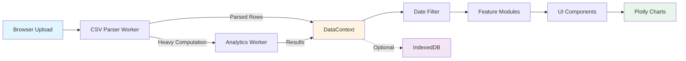
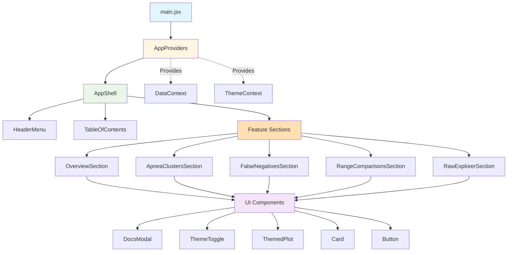
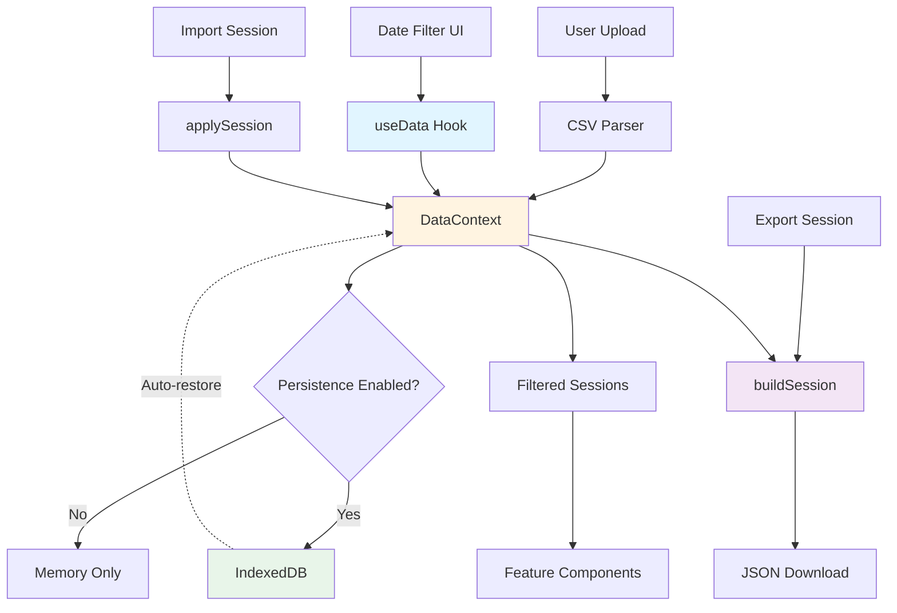

## Architecture

At heart the analyzer is a single‑page application powered by [React](https://react.dev/) and bundled with
[Vite](https://vitejs.dev/). The architecture favors plain functions and composable building blocks over heavy
framework abstractions. This section peels back the layers so you can orient yourself before diving into the source.

### High‑Level Flow

The following diagram shows how data flows through the analyzer from initial upload to rendered visualizations:

**Flow breakdown:**

1. **Entry Point** – `main.jsx` bootstraps the React app and mounts `<AppProviders><AppShell /></AppProviders>` inside a
   root DOM node. `AppProviders` centralizes shared hooks, modals, and the CSV/session state machine so feature code can
   assume those contexts already exist. Vite handles module loading and hot replacement during development.
2. **File Upload** – `useAppState` (in `src/app/useAppState.js`) hosts the CSV upload handlers. When a file is chosen, a
   dedicated parser worker filters events, converts timestamps, and streams batches with per-chunk progress updates via
   `postMessage` so the main thread receives only necessary data and remains responsive. Analysis sections render only
   after at least one row arrives, preventing charts from initializing with empty data.
3. **Context Store** – `AppProviders` wraps the tree with `DataProvider` to expose parsed rows and filtered subsets via
   hooks like `useData`, `useParameters`, and `useTheme`. Using context keeps props shallow and makes it easy to expose
   new pieces of state without threading them through every component.
4. **Visualization Components** – Each feature now lives in `src/features/<feature>/`, which bundles the `Section`
   container, local components, and colocated tests. The directory exposes a public API through `index.js` so the rest of
   the app imports `import { OverviewSection } from '@features/overview'` style entry points. Sections pull shared
   primitives (cards, modals, themed charts, etc.) from `src/components/ui`, keeping feature modules focused on
   domain-specific behavior while UI atoms stay reusable.
5. **Workers for Heavy Lifting** – Beyond CSV parsing, dedicated workers perform computationally expensive tasks such as
   k‑means clustering of apnea events and detection of likely false negatives. Offloading work keeps the UI snappy even
   with multi‑year datasets.

### Component Structure

The component hierarchy follows a clear top-down pattern:

**Component roles:**

`App.jsx` now exports `AppShell`, a lightweight composition layer that wires the header layout, table-of-contents, and
feature sections together. Sidebar links still set an "active view" state, but the heavy lifting is handled inside the
feature modules so `AppShell` stays thin. This keeps the bundle small without introducing a routing library for what is
still a tabbed interface.

Feature directories encapsulate their logic: `src/features/overview/` hosts the dashboard cards and tests, while
`src/features/apnea-clusters/` contains both the cluster analysis view and the reusable parameter metadata it exports for
tests. Shared primitives (buttons, cards, modals, themed Plotly wrappers, etc.) now live under `src/components/ui/` with
an `index.js` barrel so consumers can `import { DocsModal, ThemeToggle } from '@ui'`. Higher-level analytics widgets such
as `UsagePatternsCharts` remain in `src/components/`, but they depend on UI atoms through that barrel, keeping imports
consistent across the codebase.

An `ErrorBoundary` from `react-error-boundary` wraps most charts. Should a render error occur—perhaps due to malformed
data or a Plotly regression—the boundary displays a friendly message rather than crashing the entire app. The error is
also logged to the console for debugging.

### State and Persistence

State management flows through several layers, with clear separation between UI state and data state:

**State flow:**

`DataContext` combines several concerns:

- Parsed CSV rows
- User‑selected date ranges
- Theme (light, dark, or system)
- Session persistence flags

The `useSessionManager` hook serializes this state to `IndexedDB` using the browser's `idb` wrapper when "Remember data
locally" is enabled. Sessions can be saved, loaded, or cleared via controls in the header. Disabling persistence immediately
removes the stored session to avoid stale data. Exporting a session produces JSON that can be imported on another machine;
sensitive personal notes are intentionally excluded.

### Styling and Themes

The project uses a single `guide.css` file for global styles plus small component‑scoped CSS modules where necessary.
Color choices aim for WCAG AA contrast, and the `ThemeToggle` component flips between palettes. Plotly charts adopt the
current theme automatically through the shared `chartTheme.js` utility and the `ThemedPlot` wrapper.

### Testing Philosophy

Tests mirror how a user interacts with the UI. Components are exercised through Testing Library by querying rendered
output rather than internal implementation details. Worker logic and utilities receive focused unit tests in
`src/utils/*.test.js`. When adding a new feature, start by writing a failing test that describes the desired behavior.

### Build and Deployment

Vite compiles the app into static assets under `dist/`. The configuration enables code splitting so each view loads only
what it needs. During deployment, serve the `dist/` directory from any static host or CDN. The build includes sourcemaps
for easier debugging; omit them in production if bundle size is a concern.

Understanding this architecture should make it easier to navigate the codebase. The [dependencies](dependencies.md)
chapter dives into the specific libraries that support these patterns.

### Future Directions

The architecture intentionally leaves room to grow. Potential areas for exploration include:

- **Modular Routing** – If the number of views expands significantly, adopting a lightweight router such as `tiny-router`
  could keep `App.jsx` manageable.
- **Plugin System** – Power users may eventually want to drop in custom analyses. A plugin API that exposes data hooks
  and chart helpers could make the project a platform for experimentation.
- **Server‑side Rendering** – Although the app currently ships as a static bundle, rendering initial views on the server
  could improve startup time for massive datasets. Vite's SSR mode would make this transition relatively painless.

These ideas are not on the roadmap yet, but documenting them now invites future contributors to experiment.
