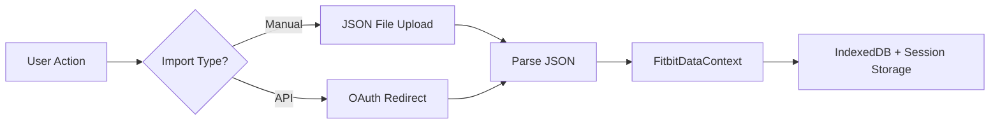
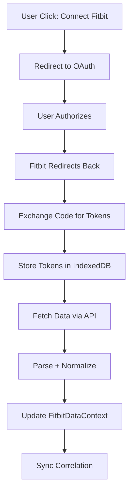
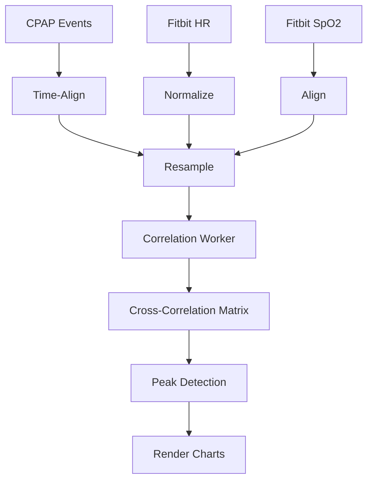
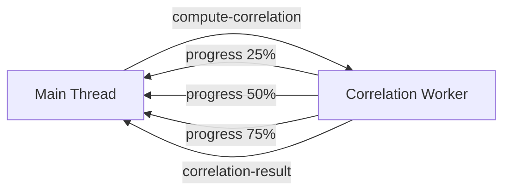
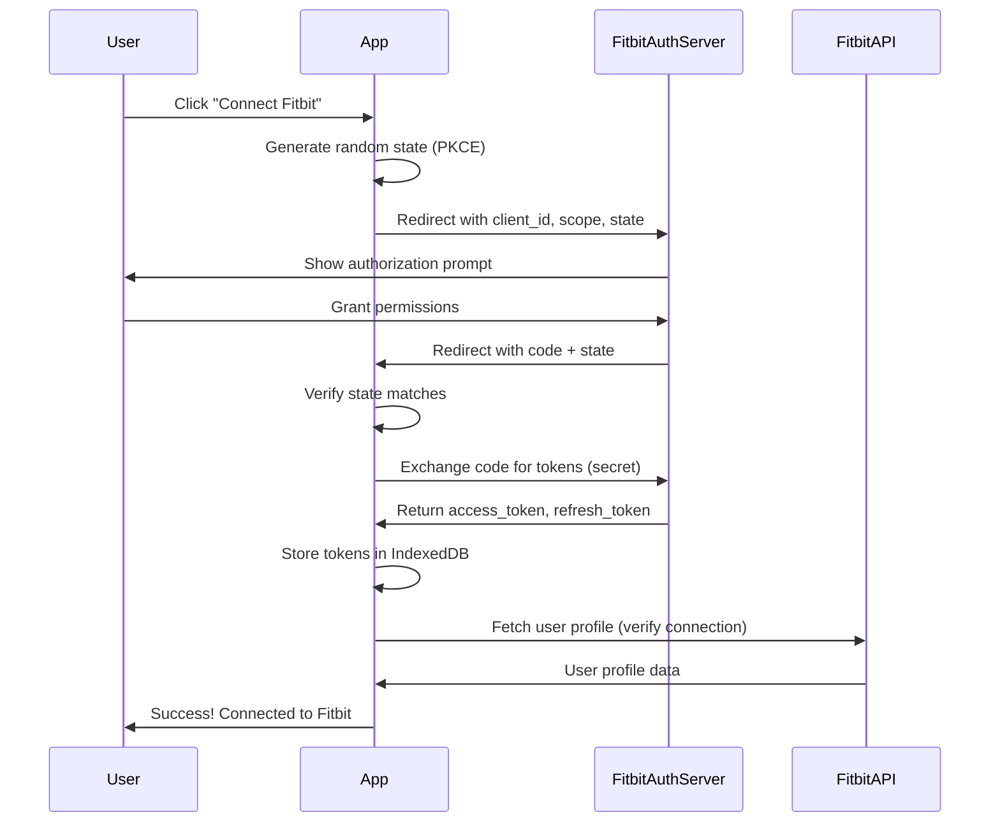

# Fitbit Integration: Technical Architecture & Implementation Approach

**Status**: Technical Planning & Brainstorm (2026-01-24)  
**Audience**: Frontend developer, architect, analytics engineer  
**Scope**: Detailed technical architecture, component structure, worker responsibilities, storage schema, and phasing strategy

---

## Executive Summary

Integrating Fitbit data into OSCAR Export Analyzer requires extending the existing Vite + React + Web Worker architecture to handle a second datasource with different characteristics:

- **Fitbit**: OAuth-authenticated API, minute-resolution time series, multiple metric endpoints
- **CPAP**: Uploaded CSV files, second/event-resolution granularity
- **Integration goal**: Correlate heart rate, SpO2, activity, and sleep metrics with CPAP apnea/flow patterns

This document outlines the architecture, phasing strategy, and concrete implementation patterns. **MVP focuses on manual JSON import** (no OAuth); **Phase 2+ adds API sync**.

---

## 1. Data Acquisition Strategy

### 1.1 Dual Import Paths



#### MVP (Phase 1): Manual JSON Import

**Process:**

1. User exports Fitbit data via Fitbit web app → local JSON file
2. UI file input: `<FitbitImportModal />` (similar to CPAP CSV upload)
3. Parse JSON using dedicated worker → `fitbit.worker.js`
4. Store in `FitbitDataContext`, persist to IndexedDB under `fitbit_sessions` store

**JSON Format (from Fitbit Web Export):**

```json
{
  "heart_rate": [
    { "value": 65, "dateTime": "2024-01-15T00:00:00Z" },
    { "value": 68, "dateTime": "2024-01-15T00:01:00Z" }
  ],
  "spo2": [
    { "value": 96, "dateTime": "2024-01-15T00:00:00Z" }
  ],
  "active_zone_minutes": [ ... ],
  "sleep": [ ... ]
}
```

#### Phase 2+: OAuth API Sync



**OAuth Flow Implementation:**

```javascript
// hooks/useFitbitOAuth.js
export const useFitbitOAuth = () => {
  const [tokens, setTokens] = useState(null);
  const [isConnected, setIsConnected] = useState(false);
  const [oauthLoading, setOauthLoading] = useState(false);

  const generateAuthUrl = useCallback(() => {
    const clientId = process.env.VITE_FITBIT_CLIENT_ID;
    const redirectUri = window.location.origin + '/oauth-callback';
    const scope = 'heartrate spo2 sleep profile';
    const state = generateRandomString(32); // PKCE protection
    sessionStorage.setItem('fitbit_oauth_state', state);

    return (
      `https://www.fitbit.com/oauth2/authorize?` +
      `response_type=code&client_id=${clientId}&` +
      `redirect_uri=${encodeURIComponent(redirectUri)}&` +
      `scope=${encodeURIComponent(scope)}&state=${state}`
    );
  }, []);

  const handleOAuthCallback = useCallback(async (code, state) => {
    // Verify state, exchange code for tokens, store securely
    // See 1.4 for token storage strategy
  }, []);

  return {
    generateAuthUrl,
    handleOAuthCallback,
    tokens,
    isConnected,
    oauthLoading,
  };
};
```

### 1.2 Date Range Mapping

**Challenge:** CPAP dates may not align exactly with Fitbit data availability.

**Solution:** Let user select mapping mode during import:

```jsx
// components/FitbitImportModal.jsx - step 2 of import wizard
<div>
  <h3>Date Range Mapping</h3>
  <p>CPAP data: {formatRange(cpapDateMin, cpapDateMax)}</p>
  <p>Fitbit data: {formatRange(fitbitDateMin, fitbitDateMax)}</p>

  <RadioGroup>
    <Label>
      <input type="radio" value="union" />
      Use union of both ranges (gaps filled with null)
    </Label>
    <Label>
      <input type="radio" value="intersection" defaultChecked />
      Use only overlapping dates
    </Label>
    <Label>
      <input type="radio" value="cpap" />
      Align to CPAP dates (pad Fitbit with nulls)
    </Label>
  </RadioGroup>
</div>
```

### 1.3 OAuth Scopes & Permissions

**Recommended MVP scope set:**

```javascript
// constants/fitbit.js
export const FITBIT_SCOPES = {
  HEARTRATE: 'heartrate', // Heart rate intraday (1-min granularity)
  SPO2: 'spo2', // Blood oxygen (available on Sense/Ionic only)
  SLEEP: 'sleep', // Sleep data (summary + stage breakdown)
  ACTIVITY: 'activity', // Steps, calories, distance, etc.
};

export const MVP_SCOPES = [
  FITBIT_SCOPES.HEARTRATE,
  FITBIT_SCOPES.SPO2,
  FITBIT_SCOPES.SLEEP,
];

// Phase 2 (if needed):
// + ACTIVITY for step counts, activity zones
// + RESPIRATORY_RATE (Sense only, advanced)
// + ECG (Ionic/Sense, if approved)
```

**Privacy implications:**

- Request minimal scopes; explain to user why each is needed
- Do NOT request nutrition/weight without clear use case
- Consider implementing scope selection UI for power users

### 1.4 Graceful Degradation

**Design principle:** App works perfectly with ONLY CPAP or ONLY Fitbit data.

```javascript
// hooks/useFitbitDataAvailable.js
export const useFitbitDataAvailable = () => {
  const { fitbitData, fitbitLoading } = useAppContext();
  return Boolean(fitbitData?.length > 0 && !fitbitLoading);
};

// components/CorrelationAnalysisSection.jsx
export function CorrelationAnalysisSection() {
  const { filteredDetails } = useAppContext();
  const hasFitbitData = useFitbitDataAvailable();

  if (!filteredDetails?.length) {
    return null; // CPAP-only feature gate
  }

  return (
    <div>
      <h2>Correlation Analysis</h2>
      {hasFitbitData ? (
        <CorrelationDashboard />
      ) : (
        <InfoBox>
          <p>Import Fitbit data to see correlation analysis.</p>
          <FitbitImportButton />
        </InfoBox>
      )}
    </div>
  );
}
```

---

## 2. Data Storage & Synchronization

### 2.1 IndexedDB Schema Extension

**New stores alongside existing `sessions` store:**

```javascript
// utils/db.js - Extended schema
const DB_NAME = 'oscar_app';
const DB_VERSION = 2; // Increment from current

const STORES = {
  SESSIONS: 'sessions', // Existing: CPAP sessions
  FITBIT_SESSIONS: 'fitbit_sessions',
  FITBIT_TOKENS: 'fitbit_tokens',
  FITBIT_CACHE: 'fitbit_cache', // API response caching
};

function initDB(db) {
  // Existing
  if (!db.objectStoreNames.contains(STORES.SESSIONS)) {
    db.createObjectStore(STORES.SESSIONS);
  }

  // New for Fitbit
  if (!db.objectStoreNames.contains(STORES.FITBIT_SESSIONS)) {
    const fitbitStore = db.createObjectStore(STORES.FITBIT_SESSIONS);
    fitbitStore.createIndex('dateRange', 'dateRange', { unique: false });
  }

  if (!db.objectStoreNames.contains(STORES.FITBIT_TOKENS)) {
    db.createObjectStore(STORES.FITBIT_TOKENS);
  }

  if (!db.objectStoreNames.contains(STORES.FITBIT_CACHE)) {
    const cacheStore = db.createObjectStore(STORES.FITBIT_CACHE);
    cacheStore.createIndex('expiresAt', 'expiresAt', { unique: false });
  }
}

// Schema for fitbit_sessions store
// key: 'latest' or date range identifier
// value: {
//   dateRange: { start: ms, end: ms },
//   metrics: {
//     heartRate: [ { timestamp: ms, value: 72, zone: 'moderate' } ],
//     spo2: [ { timestamp: ms, value: 96 } ],
//     sleep: [ { sleepStage: 'wake', start: ms, end: ms } ],
//     activity: [ { timestamp: ms, steps: 120 } ],
//   },
//   source: 'manual' | 'api',
//   importedAt: ms,
//   version: 1,
// }
```

### 2.2 Data Alignment & Normalization

**Challenge:** Fitbit uses different timestamp formats, timezones, and granularity.

**Solution: Normalization worker**

```javascript
// workers/fitbit.worker.js
self.onmessage = async (e) => {
  if (e.data.type === 'parse-fitbit-json') {
    const { jsonText, cpapTimezone, dateMapping } = e.data;

    try {
      const rawData = JSON.parse(jsonText);
      const normalized = normalizeFitbitMetrics(rawData, {
        timezone: cpapTimezone,
        dateMapping,
      });

      self.postMessage({
        type: 'fitbit-parsed',
        data: normalized,
      });
    } catch (err) {
      self.postMessage({
        type: 'fitbit-error',
        error: err.message,
      });
    }
  }
};

function normalizeFitbitMetrics(raw, options) {
  const { timezone, dateMapping } = options;

  // All timestamps converted to UTC milliseconds (consistent with CPAP)
  const normalized = {
    heartRate: raw.heart_rate
      ?.map((entry) => ({
        timestamp: new Date(entry.dateTime).getTime(),
        value: Number(entry.value),
        zone: classifyHeartRateZone(entry.value), // Custom classification
        normalized: true,
      }))
      .sort((a, b) => a.timestamp - b.timestamp),

    spo2: raw.spo2
      ?.map((entry) => ({
        timestamp: new Date(entry.dateTime).getTime(),
        value: Number(entry.value),
        normalized: true,
      }))
      .sort((a, b) => a.timestamp - b.timestamp),

    sleep: normalizeSleepData(raw.sleep, timezone),

    activity: raw.active_zone_minutes
      ?.map((entry) => ({
        timestamp: new Date(entry.dateTime).getTime(),
        minutes: Number(entry.minutes),
        heartRateZone: entry.heart_rate_zone,
        normalized: true,
      }))
      .sort((a, b) => a.timestamp - b.timestamp),
  };

  return {
    metrics: normalized,
    dateRange: {
      start: Math.min(...getAllTimestamps(normalized)),
      end: Math.max(...getAllTimestamps(normalized)),
    },
    importedAt: Date.now(),
    source: 'manual',
    version: 1,
  };
}
```

### 2.3 Caching Strategy

**Fitbit API responses can be cached locally with expiration:**

```javascript
// utils/fitbitCache.js
const CACHE_DURATION_MS = 24 * 60 * 60 * 1000; // 24 hours

export async function cacheOrFetchHeartRate(date, accessToken) {
  const db = await openDb();
  const cacheKey = `hr-${date}`;

  // Check cache
  const cached = await getFromCache(cacheKey);
  if (cached && !isCacheExpired(cached)) {
    return cached.data;
  }

  // Fetch from API
  const data = await fetchFitbitHeartRateIntraday(date, accessToken);

  // Store in cache
  await putInCache(cacheKey, data, CACHE_DURATION_MS);

  return data;
}

export async function invalidateFitbitCache() {
  const db = await openDb();
  const store = db
    .transaction(STORES.FITBIT_CACHE, 'readwrite')
    .objectStore(STORES.FITBIT_CACHE);
  store.clear();
}
```

### 2.4 Cross-Device Considerations

**How to handle encrypted export/import with both CPAP + Fitbit:**

```javascript
// Modified from existing export/import utilities
export async function exportEncryptedDataWithFitbit(password) {
  const cpapSession = await getLastSession();
  const fitbitSession = await getLastFitbitSession();

  const combined = {
    version: 2, // Bump version to indicate Fitbit support
    cpap: cpapSession,
    fitbit: fitbitSession,
    exportedAt: new Date().toISOString(),
  };

  const encrypted = await encryptData(JSON.stringify(combined), password);
  return encrypted;
}

export async function importEncryptedDataWithFitbit(encryptedData, password) {
  const decrypted = await decryptData(encryptedData, password);
  const combined = JSON.parse(decrypted);

  if (combined.version === 1) {
    // Legacy CPAP-only import
    await putLastSession(combined);
  } else if (combined.version >= 2) {
    // New Fitbit-aware import
    await putLastSession(combined.cpap);
    await putLastFitbitSession(combined.fitbit);
    return { cpapImported: true, fitbitImported: true };
  }
}
```

**Privacy safeguard:** Neither CPAP CSV data nor Fitbit JSON should be synced to cloud without explicit user permission. Store tokens separately from data.

---

## 3. Computation & Analysis Pipeline

### 3.1 Worker Responsibilities

**Extend existing `analytics.worker.js` or create new `fitbit-correlation.worker.js`?**

**Decision: Create dedicated `fitbit-correlation.worker.js`** to keep concerns separated:

```
src/workers/
├── csv.worker.js              (Existing: CPAP CSV parsing)
├── analytics.worker.js         (Existing: CPAP clustering, FN detection)
├── fitbit.worker.js            (NEW: Fitbit JSON parsing, normalization)
├── fitbit-correlation.worker.js (NEW: Cross-dataset correlation)
```

**Worker responsibilities:**

| Worker                         | Input                | Output                        | Computation                          |
| ------------------------------ | -------------------- | ----------------------------- | ------------------------------------ |
| `csv.worker.js`                | CPAP CSV text        | Parsed rows (events, summary) | CSV parsing, timestamp conversion    |
| `analytics.worker.js`          | CPAP events + params | Clusters, false negatives     | k-means, clustering algorithms       |
| `fitbit.worker.js`             | Fitbit JSON text     | Normalized metrics            | JSON parsing, time normalization     |
| `fitbit-correlation.worker.js` | Both CPAP + Fitbit   | Correlation matrix, peaks     | Cross-correlation, spectral analysis |

### 3.2 Correlation Computation Pipeline



**Message protocol for correlation analysis:**

```javascript
// In main thread (hooks/useCorrelationAnalysis.js)
const correlationWorker = new Worker(
  new URL('../workers/fitbit-correlation.worker.js', import.meta.url),
  { type: 'module' },
);

const analyzeCorrelation = (cpapEvents, fitbitMetrics, options = {}) => {
  return new Promise((resolve, reject) => {
    const handler = (e) => {
      correlationWorker.removeEventListener('message', handler);
      if (e.data.type === 'correlation-error') {
        reject(new Error(e.data.error));
      } else {
        resolve(e.data);
      }
    };

    correlationWorker.addEventListener('message', handler);

    // Convert DateTime objects to milliseconds for transfer
    const normalizedEvents = cpapEvents.map((ev) => ({
      ...ev,
      timestamp: new Date(ev.DateTime).getTime(),
    }));

    correlationWorker.postMessage({
      type: 'compute-correlation',
      events: normalizedEvents,
      fitbit: {
        heartRate: fitbitMetrics.heartRate,
        spo2: fitbitMetrics.spo2,
        activity: fitbitMetrics.activity,
      },
      options: {
        method: 'pearson', // or 'spearman'
        windowSize: 60, // 60-second sliding window
        resampleInterval: 60000, // Resample to 1-minute
      },
    });
  });
};

// In worker (workers/fitbit-correlation.worker.js)
self.onmessage = async (e) => {
  if (e.data.type === 'compute-correlation') {
    try {
      const { events, fitbit, options } = e.data;

      // Resample CPAP event density to 1-min intervals
      const cpapDensity = resampleEventDensity(
        events,
        options.resampleInterval,
      );

      // Compute cross-correlation with each Fitbit metric
      const correlations = {
        heartRate: computeCrossCorrelation(
          cpapDensity,
          fitbit.heartRate,
          options,
        ),
        spo2: computeCrossCorrelation(cpapDensity, fitbit.spo2, options),
        activity: computeCrossCorrelation(
          cpapDensity,
          fitbit.activity,
          options,
        ),
      };

      // Find peaks in correlation signal (lag values with highest correlation)
      const peaks = detectCorrelationPeaks(correlations);

      self.postMessage({
        type: 'correlation-result',
        correlations,
        peaks,
        summary: {
          maxLag: peaks[0]?.lag || null,
          maxCorrelation: peaks[0]?.value || null,
        },
      });
    } catch (err) {
      self.postMessage({
        type: 'correlation-error',
        error: err.message,
      });
    }
  }
};
```

### 3.3 Progressive Computation

**For large datasets, compute correlations incrementally:**

```javascript
// Simulate streaming correlation updates
const computeCorrelationIncremental = (
  cpapEvents,
  fitbitMetrics,
  batchSize = 100,
) => {
  let computed = 0;

  const iterator = (function* () {
    for (let i = 0; i < cpapEvents.length; i += batchSize) {
      const batch = cpapEvents.slice(i, i + batchSize);
      const result = performBatchCorrelation(batch, fitbitMetrics);

      computed += result.count;

      yield {
        type: 'correlation-progress',
        computed,
        total: cpapEvents.length,
        percentage: Math.round((computed / cpapEvents.length) * 100),
        partial: result,
      };
    }
  })();

  return iterator;
};
```

### 3.4 Real-Time Updates

**Correlation should update when user adjusts date filter:**

```javascript
// hooks/useCorrelationAnalysis.js
export const useCorrelationAnalysis = () => {
  const { filteredDetails, fitbitData } = useAppContext();
  const [correlation, setCorrelation] = useState(null);
  const [computing, setComputing] = useState(false);

  useEffect(() => {
    if (!filteredDetails?.length || !fitbitData?.length) {
      setCorrelation(null);
      return;
    }

    setComputing(true);

    analyzeCorrelation(filteredDetails, fitbitData)
      .then((result) => {
        setCorrelation(result);
      })
      .catch((err) => console.error('Correlation failed:', err))
      .finally(() => setComputing(false));
  }, [filteredDetails, fitbitData]); // Recompute on filter change

  return { correlation, computing };
};
```

---

## 4. Component Architecture

### 4.1 Feature Structure

**New feature module: `src/features/fitbit-correlation/`**

```
src/features/fitbit-correlation/
├── Section.jsx                    (Feature wrapper, gated by data availability)
├── CorrelationDashboard.jsx      (Main visualization)
├── CorrelationCharts.jsx         (Plotly charts: scatter, time series)
├── FitbitImportModal.jsx         (Multi-step import wizard)
├── MetricSelector.jsx            (Checkboxes for HR, SpO2, activity)
├── LagsAndPeaksPanel.jsx         (Display detected lag values)
├── index.js                      (Export public API)
├── Section.test.jsx
├── CorrelationCharts.test.jsx
└── fitbit-correlation.test.jsx
```

**Example: `Section.jsx`** (follows existing pattern from `overview/Section.jsx`):

```jsx
// src/features/fitbit-correlation/Section.jsx
import React from 'react';
import CorrelationDashboard from './CorrelationDashboard';
import { useAppContext } from '../../app/AppProviders';
import { useFitbitDataAvailable } from '../../hooks/useFitbitDataAvailable';

/**
 * Feature section wrapper for Fitbit correlation analysis.
 *
 * Only renders if both CPAP and Fitbit data are available.
 * Delegates visualization to CorrelationDashboard.
 */
export default function CorrelationSection() {
  const { filteredDetails, fitbitData } = useAppContext();
  const hasFitbitData = useFitbitDataAvailable();

  // Gate rendering: require both datasets
  if (!filteredDetails?.length || !hasFitbitData) {
    return null;
  }

  return (
    <div className="section" id="fitbit-correlation">
      <h2>Fitbit Correlation Analysis</h2>
      <CorrelationDashboard
        cpapEvents={filteredDetails}
        fitbitData={fitbitData}
      />
    </div>
  );
}
```

### 4.2 Custom Hooks for Fitbit Data Access

```javascript
// hooks/useFitbitMetrics.js
export const useFitbitMetrics = () => {
  const { fitbitData } = useAppContext();

  return {
    heartRate: fitbitData?.metrics.heartRate || [],
    spo2: fitbitData?.metrics.spo2 || [],
    activity: fitbitData?.metrics.activity || [],
    sleep: fitbitData?.metrics.sleep || [],

    // Utility methods
    getHeartRateStats: () => computeStats(fitbitData?.metrics.heartRate),
    getSpo2Range: () => getRange(fitbitData?.metrics.spo2),
  };
};

// hooks/useFitbitDataAvailable.js
export const useFitbitDataAvailable = () => {
  const { fitbitData } = useAppContext();
  return Boolean(fitbitData && !fitbitData.isEmpty);
};

// hooks/useCorrelationAnalysis.js
export const useCorrelationAnalysis = () => {
  const { filteredDetails } = useAppContext();
  const fitbitMetrics = useFitbitMetrics();
  const [result, setResult] = useState(null);
  const [loading, setLoading] = useState(false);

  // ... correlation computation logic (see section 3.2)

  return {
    result,
    loading,
    recompute: () => {
      /* ... */
    },
  };
};
```

### 4.3 Reusable Visualization Components

**Leverage existing chart infrastructure, add Fitbit-specific visualizations:**

```jsx
// components/FitbitHeartRateChart.jsx
import Plot from 'react-plotly.js';

export function FitbitHeartRateChart({ heartRateData, highlightEvents = [] }) {
  const trace = {
    x: heartRateData.map((d) => new Date(d.timestamp)),
    y: heartRateData.map((d) => d.value),
    type: 'scatter',
    mode: 'lines',
    name: 'Heart Rate',
    line: { color: '#e74c3c' },
  };

  const eventMarkers = highlightEvents.map((ev) => ({
    x: new Date(ev.timestamp),
    y: ev.heartRate,
    type: 'scatter',
    mode: 'markers',
    name: 'Apnea Event',
    marker: { size: 8, color: '#c0392b', symbol: 'circle-open' },
  }));

  return (
    <Plot
      data={[trace, ...eventMarkers]}
      layout={{
        title: 'Fitbit Heart Rate',
        xaxis: { title: 'Time' },
        yaxis: { title: 'BPM' },
      }}
      style={{ width: '100%', height: '400px' }}
    />
  );
}
```

### 4.4 State Management Integration

**Extend `useAppState` to include Fitbit state:**

```javascript
// app/useAppState.js (modifications)
export const useAppState = () => {
  // Existing CPAP state...
  const { summaryData, detailsData, ...cpapState } = useCsvFiles();

  // NEW: Fitbit state
  const { fitbitData, setFitbitData, fitbitLoading, fitbitProgress } =
    useFitbitFiles();
  const { fitbitDataForSession, setFitbitDataForSession } =
    useSessionManager(fitbitData);

  return {
    // Existing CPAP state...
    ...cpapState,

    // NEW: Fitbit state
    fitbitData,
    setFitbitData,
    fitbitLoading,
    fitbitProgress,
    fitbitDataForSession,
    setFitbitDataForSession,

    // Correlation state
    correlationResult: null, // Computed on-demand by features
  };
};
```

**Update `FitbitDataContext` (new):**

```jsx
// context/FitbitDataContext.jsx
import { createContext, useContext } from 'react';

export const FitbitDataContext = createContext(null);

export function FitbitDataProvider({ children, data, dateRange }) {
  return (
    <FitbitDataContext.Provider value={{ data, dateRange }}>
      {children}
    </FitbitDataContext.Provider>
  );
}

export function useFitbitDataContext() {
  const ctx = useContext(FitbitDataContext);
  if (!ctx) {
    throw new Error(
      'useFitbitDataContext must be used within FitbitDataProvider',
    );
  }
  return ctx;
}
```

**Update `AppProviders.jsx` to wrap with `FitbitDataProvider`:**

```jsx
// app/AppProviders.jsx (modifications)
export function AppProviders({ children }) {
  const state = useAppState();

  return (
    <AppStateContext.Provider value={state}>
      <GuideContext.Provider value={guide}>
        <FitbitDataProvider
          data={state.fitbitData}
          dateRange={state.fitbitDateRange}
        >
          <DataProvider
            summaryData={state.summaryData}
            detailsData={state.detailsData}
            fitbitData={state.fitbitData}
          >
            {children}
          </DataProvider>
        </FitbitDataProvider>
      </GuideContext.Provider>
    </AppStateContext.Provider>
  );
}
```

---

## 5. API Integration Pattern

### 5.1 OAuth Token Management (Phase 2+)

**Secure token storage strategy:**

```javascript
// utils/fitbitAuth.js
const FITBIT_CONFIG = {
  clientId: process.env.VITE_FITBIT_CLIENT_ID,
  redirectUri: `${window.location.origin}/oauth-callback`,
  tokenEndpoint: 'https://api.fitbit.com/oauth2/token',
};

/**
 * Secure token storage:
 * - Access token: IndexedDB (short-lived, 8 hours)
 * - Refresh token: IndexedDB with encryption wrapper
 * - NEVER store in localStorage (vulnerable to XSS)
 * - NEVER expose tokens in Redux store (risk of devtools leak)
 */
export async function storeTokens(accessToken, refreshToken, expiresIn) {
  const db = await openDb();
  const expiresAt = Date.now() + expiresIn * 1000;

  const tokenData = {
    accessToken,
    refreshToken,
    expiresAt,
    type: 'Bearer',
  };

  const tx = db.transaction(STORES.FITBIT_TOKENS, 'readwrite');
  tx.objectStore(STORES.FITBIT_TOKENS).put(tokenData, 'current');

  return new Promise((resolve, reject) => {
    tx.oncomplete = () => resolve(true);
    tx.onerror = () => reject(tx.error);
  });
}

export async function getAccessToken() {
  const stored = await getTokens();

  if (!stored) return null;

  // Check expiration
  if (Date.now() > stored.expiresAt) {
    // Attempt refresh
    const refreshed = await refreshAccessToken(stored.refreshToken);
    if (refreshed) return refreshed.accessToken;
    return null;
  }

  return stored.accessToken;
}

export async function refreshAccessToken(refreshToken) {
  const response = await fetch(FITBIT_CONFIG.tokenEndpoint, {
    method: 'POST',
    headers: {
      'Content-Type': 'application/x-www-form-urlencoded',
      Authorization: `Basic ${btoa(FITBIT_CONFIG.clientId + ':')}`,
    },
    body: new URLSearchParams({
      grant_type: 'refresh_token',
      refresh_token: refreshToken,
    }),
  });

  if (!response.ok) {
    throw new Error('Token refresh failed');
  }

  const data = await response.json();
  await storeTokens(data.access_token, data.refresh_token, data.expires_in);
  return data;
}
```

### 5.2 API Request Wrapper

```javascript
// utils/fitbitApi.js
/**
 * Wrapper for Fitbit API calls with automatic token refresh,
 * rate limiting, and error handling.
 */
export async function fitbitApiCall(endpoint, options = {}) {
  const accessToken = await getAccessToken();

  if (!accessToken) {
    throw new Error('Not authenticated with Fitbit. Please reconnect.');
  }

  const url = `https://api.fitbit.com/1.2${endpoint}`;

  let response = await fetch(url, {
    headers: {
      Authorization: `Bearer ${accessToken}`,
      Accept: 'application/json',
      ...options.headers,
    },
    ...options,
  });

  // Handle 401 (token expired) with automatic refresh
  if (response.status === 401) {
    const tokens = await getTokens();
    const refreshed = await refreshAccessToken(tokens.refreshToken);

    if (refreshed) {
      response = await fetch(url, {
        headers: {
          Authorization: `Bearer ${refreshed.accessToken}`,
          Accept: 'application/json',
          ...options.headers,
        },
        ...options,
      });
    }
  }

  // Handle 429 (rate limit)
  if (response.status === 429) {
    const retryAfter = parseInt(
      response.headers.get('Retry-After') || '60',
      10,
    );
    throw new RateLimitError(
      `Fitbit API rate limit exceeded. Retry after ${retryAfter}s`,
      retryAfter,
    );
  }

  if (!response.ok) {
    throw new Error(`Fitbit API error: ${response.statusText}`);
  }

  return response.json();
}

/**
 * Fetch heart rate intraday data (1-minute resolution)
 */
export async function fetchHeartRateIntraday(date) {
  const dateStr = date.toISOString().split('T')[0];
  return fitbitApiCall(`/user/-/activities/heart/date/${dateStr}/1d/1min.json`);
}

/**
 * Fetch SpO2 data for a date range
 */
export async function fetchSpo2DateRange(startDate, endDate) {
  const start = startDate.toISOString().split('T')[0];
  const end = endDate.toISOString().split('T')[0];
  return fitbitApiCall(`/user/-/spo2/date/${start}/${end}.json`);
}
```

### 5.3 Rate Limiting & Backoff

```javascript
// utils/fitbitRateLimit.js
class FitbitRateLimiter {
  constructor(options = {}) {
    this.maxRequests = options.maxRequests || 150; // Fitbit limit
    this.windowMs = options.windowMs || 3600000; // 1 hour
    this.queue = [];
    this.count = 0;
  }

  async executeWithLimit(fn) {
    // If at limit, wait for window reset
    if (this.count >= this.maxRequests) {
      const waitTime = this.windowMs / (this.maxRequests - this.count);
      await delay(waitTime);
    }

    this.count += 1;
    return fn();
  }
}

export const fitbitRateLimiter = new FitbitRateLimiter();
```

### 5.4 Error Handling & User Feedback

```javascript
// Wrapper around API calls with user-facing error messages
export async function fetchFitbitDataWithErrorHandling(dateRange) {
  try {
    return await fitbitApiCall(
      `/user/-/activities/heart/date/${dateRange}.json`,
    );
  } catch (err) {
    if (err instanceof RateLimitError) {
      return {
        error: 'Rate limit reached',
        message: `Please try again in ${err.retryAfter} seconds`,
        retryAfter: err.retryAfter,
      };
    } else if (err.message.includes('401')) {
      return {
        error: 'Authentication expired',
        message: 'Please reconnect your Fitbit account',
        action: 'reconnect',
      };
    } else {
      return {
        error: 'Data fetch failed',
        message: err.message,
      };
    }
  }
}
```

---

## 6. Data Format & Transformation

### 6.1 Timestamp Normalization

**All timestamps normalized to UTC milliseconds (consistent with CPAP):**

```javascript
// utils/fitbitTransform.js
/**
 * Normalize Fitbit timestamp to UTC milliseconds
 * Handles various Fitbit timestamp formats
 */
export function normalizeFitbitTimestamp(fitbitTimestamp) {
  // Fitbit ISO format: "2024-01-15T12:30:00Z" or local time
  if (typeof fitbitTimestamp === 'string') {
    return new Date(fitbitTimestamp).getTime();
  }
  if (typeof fitbitTimestamp === 'number') {
    return fitbitTimestamp; // Already milliseconds?
  }
  return null;
}

/**
 * Align Fitbit data to CPAP session timezone
 * CPAP data uses local device time; Fitbit uses user's set timezone
 */
export function alignToSessionTimezone(fitbitData, cpapSession) {
  const cpapTz = extractTimezoneFromCpapData(cpapSession);

  return fitbitData.map((point) => ({
    ...point,
    timestamp: convertToTimezone(point.timestamp, cpapTz),
  }));
}
```

### 6.2 Metric Mapping & Aggregation

**Map Fitbit metrics to internal naming convention:**

```javascript
// constants/fitbitMetrics.js
export const FITBIT_METRICS = {
  HEART_RATE: 'heartRate',
  SPO2: 'spo2',
  ACTIVITY: 'activity',
  SLEEP_STAGE: 'sleepStage',
  RESPIRATORY_RATE: 'respiratoryRate',
};

export const FITBIT_HEART_RATE_ZONES = {
  OUT_OF_RANGE: 'outOfRange',
  FAT_BURN: 'fatBurn',
  CARDIO: 'cardio',
  PEAK: 'peak',
};

// utils/fitbitTransform.js
export function normalizeHeartRateZone(fitbitZone) {
  // Fitbit API returns: "Out of Range", "Fat Burn", "Cardio", "Peak"
  const zoneMap = {
    'Out of Range': FITBIT_HEART_RATE_ZONES.OUT_OF_RANGE,
    'Fat Burn': FITBIT_HEART_RATE_ZONES.FAT_BURN,
    Cardio: FITBIT_HEART_RATE_ZONES.CARDIO,
    Peak: FITBIT_HEART_RATE_ZONES.PEAK,
  };
  return zoneMap[fitbitZone] || fitbitZone;
}

/**
 * Aggregate minute-level Fitbit data to hourly summaries
 */
export function aggregateFitbitToHourly(minuteData) {
  const hourlyBuckets = {};

  minuteData.forEach((point) => {
    const hour =
      Math.floor(point.timestamp / (60 * 60 * 1000)) * (60 * 60 * 1000);
    if (!hourlyBuckets[hour]) hourlyBuckets[hour] = [];
    hourlyBuckets[hour].push(point);
  });

  return Object.entries(hourlyBuckets).map(([hour, points]) => ({
    timestamp: Number(hour),
    avg: points.reduce((s, p) => s + p.value, 0) / points.length,
    min: Math.min(...points.map((p) => p.value)),
    max: Math.max(...points.map((p) => p.value)),
    count: points.length,
  }));
}
```

### 6.3 Quality Flags

**Mark data with reliability metadata:**

```javascript
// Data structure with quality tracking
const fitbitMetricWithQuality = {
  timestamp: 1705322400000,
  value: 72,
  zone: 'cardio',

  // Quality metadata
  quality: {
    source: 'sensor', // 'sensor' | 'manual' | 'estimated'
    confidence: 0.95, // 0-1 scale
    syncDelay: 30, // seconds after recording
    dataComplete: true, // False if device was off
  },
};

export function markDataQuality(fitbitPoint, cpapSession) {
  const syncDelay = calculateSyncDelay(fitbitPoint, cpapSession);
  const isOutlier = isStatisticalOutlier(fitbitPoint, cpapSession);

  return {
    ...fitbitPoint,
    quality: {
      source: fitbitPoint.source || 'sensor',
      confidence: isOutlier ? 0.7 : 0.95,
      syncDelay,
      dataComplete: !hasDeviceGaps(fitbitPoint),
    },
  };
}
```

---

## 7. Web Worker Usage

### 7.1 Worker Lifecycle

**Pattern: create workers on-demand, terminate after use**

```javascript
// hooks/useFitbitParser.js
export const useFitbitParser = () => {
  const workerRef = useRef(null);
  const [loading, setLoading] = useState(false);
  const [progress, setProgress] = useState(0);

  useEffect(() => {
    return () => {
      // Cleanup: terminate worker on unmount
      if (workerRef.current) {
        workerRef.current.terminate();
      }
    };
  }, []);

  const parseFitbitJson = useCallback((jsonText) => {
    return new Promise((resolve, reject) => {
      if (!workerRef.current) {
        workerRef.current = new Worker(
          new URL('../workers/fitbit.worker.js', import.meta.url),
          { type: 'module' },
        );
      }

      const handleMessage = (e) => {
        if (e.data.type === 'progress') {
          setProgress(e.data.percent);
        } else if (e.data.type === 'fitbit-parsed') {
          workerRef.current.removeEventListener('message', handleMessage);
          resolve(e.data);
        } else if (e.data.type === 'fitbit-error') {
          workerRef.current.removeEventListener('message', handleMessage);
          reject(new Error(e.data.error));
        }
      };

      workerRef.current.addEventListener('message', handleMessage);
      setLoading(true);

      workerRef.current.postMessage({
        type: 'parse-fitbit-json',
        jsonText,
      });
    }).finally(() => setLoading(false));
  }, []);

  return { parseFitbitJson, loading, progress };
};
```

### 7.2 Message Protocol

**Standardized message format with `type` field:**

```javascript
// Message from main thread → worker
{
  type: 'parse-fitbit-json' | 'compute-correlation' | 'aggregate-metrics',
  data: { ... },
}

// Message from worker → main thread
{
  type: 'fitbit-parsed' | 'correlation-result' | 'progress' | 'fitbit-error',
  percent?: 0-100,  // For progress updates
  data?: { ... },   // For success results
  error?: string,   // For error results
}
```

### 7.3 Correlation Worker Message Flow



---

## 8. Performance Considerations

### 8.1 Bundle Size Impact

**Estimated additions:**

| Component                          | Size         | Notes                                              |
| ---------------------------------- | ------------ | -------------------------------------------------- |
| Fitbit parsing + correlation logic | ~15KB        | Minimal; mostly algorithmic                        |
| OAuth library (if used)            | ~5-10KB      | Built-in Web Crypto APIs preferred                 |
| Additional workers                 | ~8KB         | `fitbit.worker.js`, `fitbit-correlation.worker.js` |
| **Total estimated**                | **~25-30KB** | Acceptable; < 5% growth                            |

**Mitigation strategies:**

- Code-split Fitbit features: lazy-load on first FitbitImportModal open
- Tree-shake unused OAuth code in MVP (Phase 1 = no OAuth)
- Keep correlation algorithms as pure functions (easy to optimize/remove)

### 8.2 Parsing Performance

**Expected parsing times:**

- **CPAP CSV**: 1-2 seconds for 1 year of data (existing, optimized)
- **Fitbit JSON**: 500ms-1s for 1 year of minute-level data
- **Correlation analysis**: 2-5 seconds for 1-year correlation matrix

**Optimization checklist:**

- Use typed arrays for time series (Float32Array for values)
- Batch normalization to avoid repeated conversions
- Cache aggregated results (hourly summaries)
- Lazy-load correlation results until requested

### 8.3 Memory Usage

**Estimated memory footprint for 1 year of data:**

| Dataset                                 | Size         | Notes                                   |
| --------------------------------------- | ------------ | --------------------------------------- |
| CPAP (365 nights × 1000 events/night)   | ~5MB         | Existing                                |
| Fitbit HR (1-min × 365 × 480 min/day)   | ~2MB         | 175K data points                        |
| Fitbit SpO2 (1-min × 365 × 480 min/day) | ~2MB         | Variable; often sparse                  |
| Correlation matrix                      | ~1MB         | 365 × 1440 matrix for daily correlation |
| **Total**                               | **~10-12MB** | Acceptable for modern browsers          |

### 8.4 Caching Strategy

```javascript
// In analytics hook: cache expensive correlations
const useCorrelationAnalysisWithCache = () => {
  const cacheRef = useRef(new Map());

  const getCachedOrCompute = useCallback(
    async (cpapEvents, fitbitData, options) => {
      // Create cache key from input hashes
      const cacheKey = hashInputs(cpapEvents, fitbitData, options);

      if (cacheRef.current.has(cacheKey)) {
        return cacheRef.current.get(cacheKey);
      }

      const result = await analyzeCorrelation(cpapEvents, fitbitData, options);
      cacheRef.current.set(cacheKey, result);

      // Limit cache size to 5 entries
      if (cacheRef.current.size > 5) {
        const firstKey = cacheRef.current.keys().next().value;
        cacheRef.current.delete(firstKey);
      }

      return result;
    },
    [],
  );

  return { getCachedOrCompute };
};
```

---

## 9. Testing Strategy

### 9.1 Mock Fitbit Data Fixtures

```javascript
// src/test-utils/fitbit-builders.js
export function buildFitbitHeartRatePoint({
  timestamp = Date.now(),
  value = 72,
  zone = 'cardio',
} = {}) {
  return { timestamp, value, zone };
}

export function buildFitbitDayData({
  date = new Date('2024-01-15'),
  heartRatePoints = 480, // 1-minute intervals
  spo2Sparse = true, // SpO2 is typically sparse
} = {}) {
  const start = date.getTime();
  const points = [];

  for (let i = 0; i < heartRatePoints; i++) {
    points.push(
      buildFitbitHeartRatePoint({
        timestamp: start + i * 60 * 1000,
        value: 50 + Math.random() * 80,
      }),
    );
  }

  return {
    metrics: {
      heartRate: points,
      spo2: spo2Sparse ? generateSparseSpo2Data(start) : points,
      activity: generateActivityData(start),
    },
    dateRange: { start, end: start + 24 * 60 * 60 * 1000 },
  };
}

// Unit test example
describe('fitbitTransform', () => {
  it('normalizes Fitbit timestamps to UTC milliseconds', () => {
    const fitbitData = buildFitbitHeartRatePoint({
      timestamp: new Date('2024-01-15T12:30:00Z').getTime(),
      value: 75,
    });

    const normalized = normalizeFitbitTimestamp(fitbitData.timestamp);
    expect(normalized).toEqual(1705329000000);
  });

  it('handles missing heart rate zones gracefully', () => {
    const point = { timestamp: Date.now(), value: 72 }; // No zone
    const result = markDataQuality(point, {});

    expect(result.quality.confidence).toBeGreaterThan(0);
  });
});
```

### 9.2 Integration Tests

```javascript
// App.fitbit-import.test.jsx
describe('Fitbit Import Integration', () => {
  it('imports Fitbit JSON and stores in IndexedDB', async () => {
    const { user, rerender } = render(<AppShell />);

    // Open Fitbit import modal
    await user.click(screen.getByRole('button', { name: /import fitbit/i }));

    // Upload file
    const fitbitJson = buildFitbitDayData();
    const file = new File([JSON.stringify(fitbitJson)], 'fitbit.json', {
      type: 'application/json',
    });
    await user.upload(screen.getByLabelText(/fitbit file/i), file);

    // Wait for import
    await waitFor(() => {
      expect(screen.getByText(/successfully imported/i)).toBeInTheDocument();
    });

    // Verify stored in IndexedDB
    const stored = await getLastFitbitSession();
    expect(stored.metrics.heartRate).toHaveLength(480);
  });

  it('renders correlation section when both CPAP and Fitbit data present', async () => {
    // Load both datasets
    await loadCpapData();
    await loadFitbitData();

    const { rerender } = render(<AppShell />);

    expect(screen.getByText('Fitbit Correlation Analysis')).toBeInTheDocument();
  });

  it('hides correlation section when only CPAP data available', () => {
    render(<AppShell />); // No Fitbit data

    expect(
      screen.queryByText('Fitbit Correlation Analysis'),
    ).not.toBeInTheDocument();
  });
});
```

### 9.3 Worker Tests

```javascript
// workers/fitbit.worker.test.js
describe('Fitbit Parser Worker', () => {
  it('parses Fitbit JSON and normalizes timestamps', (done) => {
    const worker = new Worker(new URL('./fitbit.worker.js', import.meta.url), {
      type: 'module',
    });

    const fitbitData = buildFitbitDayData();

    worker.onmessage = (e) => {
      expect(e.data.type).toBe('fitbit-parsed');
      expect(e.data.data.metrics.heartRate[0]).toHaveProperty('timestamp');
      expect(typeof e.data.data.metrics.heartRate[0].timestamp).toBe('number');

      worker.terminate();
      done();
    };

    worker.postMessage({
      type: 'parse-fitbit-json',
      jsonText: JSON.stringify(fitbitData),
    });
  });
});
```

### 9.4 Performance Tests

```javascript
// src/features/fitbit-correlation/CorrelationCharts.perf.test.jsx
describe('Correlation Analysis Performance', () => {
  it('computes correlation for 1-year dataset in < 5s', async () => {
    const cpapEvents = buildNightSession({ durationHours: 8 }).events;
    const fitbitData = buildFitbitDayData();

    const startTime = performance.now();
    const result = await analyzeCorrelation(cpapEvents, fitbitData);
    const elapsed = performance.now() - startTime;

    expect(elapsed).toBeLessThan(5000);
    expect(result).toHaveProperty('correlations');
  });
});
```

### 9.5 Accessibility Tests

```javascript
// components/FitbitImportModal.a11y.test.jsx
describe('FitbitImportModal A11y', () => {
  it('has proper ARIA labels for form fields', () => {
    render(<FitbitImportModal onImport={() => {}} />);

    expect(screen.getByLabelText(/fitbit json file/i)).toBeInTheDocument();
    expect(screen.getByLabelText(/date mapping mode/i)).toBeInTheDocument();
  });

  it('is keyboard navigable', async () => {
    const { user } = render(<FitbitImportModal onImport={() => {}} />);

    // Tab through form
    await user.keyboard('{Tab}{Tab}{Tab}{Enter}');

    expect(screen.getByRole('button', { name: /import/i })).toHaveFocus();
  });
});
```

---

## 10. Phasing Strategy

### Phase 1: MVP (Q1 2026) - Manual Import

**Scope:**

- File upload for Fitbit JSON exports
- Data normalization & storage in IndexedDB
- Basic data explorer (table view of metrics)
- Simple time-aligned visualization

**Deliverables:**

- `FitbitImportModal` component
- `fitbit.worker.js` (JSON parsing)
- `useFitbitFiles` hook
- `useFitbitMetrics` hook
- Basic unit & integration tests
- User documentation on Fitbit export process

**Not included:**

- OAuth authentication
- Correlation analysis
- API-based sync
- Real-time updates

**Success criteria:**

- Users can import Fitbit JSON exports
- Data persists across sessions
- Charts render without performance degradation
- All tests passing; no console warnings

### Phase 2: Correlation Analysis (Q2 2026)

**Scope:**

- Correlation computation (cross-correlation algorithm)
- Peak detection (lag values with highest correlation)
- `CorrelationDashboard` visualization
- Performance optimization for large datasets

**Deliverables:**

- `fitbit-correlation.worker.js`
- `CorrelationDashboard` component with Plotly charts
- `useCorrelationAnalysis` hook
- Algorithm documentation & validation
- Performance benchmarks

**Success criteria:**

- Correlation results update in real-time as user adjusts date filters
- Peak lags detected correctly against reference datasets
- < 5s computation time for 1-year datasets
- Documented correlation interpretation guide

### Phase 3: OAuth API Sync (Q3 2026)

**Scope:**

- OAuth 2.0 authentication flow
- Fitbit API integration
- Token refresh & error handling
- Incremental data sync
- Rate limiting & caching

**Deliverables:**

- `useFitbitOAuth` hook
- `fitbitApi.js` wrapper with rate limiting
- `FitbitOAuthModal` component
- API integration tests
- Token security audit

**Success criteria:**

- OAuth flow completes without user friction
- Tokens refreshed automatically
- Graceful handling of rate limits
- No unencrypted tokens in localStorage

### Phase 4: Advanced Features (Q4 2026+)

**Scope:**

- Real-time sync notifications
- Multi-device pairing (watch history)
- Advanced correlation metrics (spectral analysis, causality detection)
- Export correlation reports

**Not committed to timeline; dependent on Phase 1-3 success**

---

## 11. Security & Privacy Considerations

### 11.1 Data Sensitivity

**CRITICAL: Do NOT store real patient data in temporary directories or logs.**

Protected Health Information (PHI):

- Actual Fitbit metric values from real users
- Timestamps of CPAP usage (reveals sleep patterns)
- Heart rate data
- SpO2 readings
- Any derivative analysis

**Safe practices:**

- ✅ Use synthetic test data from builders (see 9.1)
- ✅ Reference data by description: "high-AHI session", "SpO2 dip event"
- ✅ Log only: "parsed 1440 points", "correlation=0.72"
- ✅ Use mock API responses in tests

**Unsafe practices (NEVER):**

- ❌ Copy real CSV/JSON exports to `temp/` or `docs/work/`
- ❌ Log: "AHI=42.3 at 2024-01-15T02:30:00Z"
- ❌ Screenshot charts with real patient data
- ❌ Commit CSV excerpts even if "anonymized"

### 11.2 Token Security

**OAuth tokens are sensitive; store securely:**

```javascript
// ❌ WRONG: Tokens in localStorage (vulnerable to XSS)
localStorage.setItem('fitbit_token', accessToken);

// ❌ WRONG: Tokens in Redux store (visible in devtools)
store.dispatch({ type: 'SET_FITBIT_TOKEN', payload: accessToken });

// ✅ RIGHT: IndexedDB with encryption wrapper (optional for Phase 1, required Phase 2+)
await storeTokens(accessToken, refreshToken, expiresIn);

// ✅ RIGHT: Memory-only during session (lost on page reload)
const tokenRef = useRef(accessToken);
```

### 11.3 Encrypted Export/Import

**Both CPAP and Fitbit data should be encrypted when exported:**

```javascript
// See section 2.4 for updated export/import functions
// Ensures users can securely backup and restore combined datasets
export async function exportEncryptedDataWithFitbit(password) {
  /* ... */
}
```

### 11.4 Local-First Privacy Architecture

**Design principle: App is completely functional offline with local data only.**

- No cloud sync by default
- Fitbit API calls are opt-in (explicit user action)
- All data persisted to IndexedDB (encrypted export available)
- Network requests logged transparently for user awareness

---

## 12. Implementation Checklist

### Component Scaffold

- [ ] `src/features/fitbit-correlation/Section.jsx`
- [ ] `src/features/fitbit-correlation/CorrelationDashboard.jsx`
- [ ] `src/features/fitbit-correlation/CorrelationCharts.jsx`
- [ ] `src/features/fitbit-correlation/FitbitImportModal.jsx`
- [ ] `src/features/fitbit-correlation/MetricSelector.jsx`
- [ ] `src/features/fitbit-correlation/index.js`

### Hooks & State Management

- [ ] `src/hooks/useFitbitFiles.js` (File upload + worker coordination)
- [ ] `src/hooks/useFitbitMetrics.js` (Data access helpers)
- [ ] `src/hooks/useFitbitDataAvailable.js` (Availability check)
- [ ] `src/hooks/useCorrelationAnalysis.js` (Main correlation logic)
- [ ] `src/hooks/useFitbitOAuth.js` (Phase 2: OAuth flow)
- [ ] `src/context/FitbitDataContext.jsx` (New context)

### Workers

- [ ] `src/workers/fitbit.worker.js` (JSON parsing + normalization)
- [ ] `src/workers/fitbit.worker.test.js`
- [ ] `src/workers/fitbit-correlation.worker.js` (Correlation computation)
- [ ] `src/workers/fitbit-correlation.worker.test.js`

### Utilities

- [ ] `src/utils/fitbitTransform.js` (Normalization, aggregation)
- [ ] `src/utils/db.js` (Extend for Fitbit IndexedDB stores)
- [ ] `src/utils/fitbitCache.js` (API response caching)
- [ ] `src/utils/fitbitAuth.js` (Token management, Phase 2+)
- [ ] `src/utils/fitbitApi.js` (API wrapper, Phase 2+)

### Test Builders & Mocks

- [ ] `src/test-utils/fitbit-builders.js` (Synthetic Fitbit data)
- [ ] `src/test-utils/fitbit-mocks.js` (API mocks)

### Tests

- [ ] `src/features/fitbit-correlation/*.test.jsx` (Component tests)
- [ ] `src/hooks/fitbit*.test.js` (Hook tests)
- [ ] `src/workers/fitbit*.test.js` (Worker tests)
- [ ] `src/App.fitbit-*.test.jsx` (Integration tests)

### Documentation

- [ ] Update `docs/developer/architecture.md` (Add Fitbit section)
- [ ] Add `docs/developer/fitbit-implementation.md` (Detailed walkthrough)
- [ ] Update `CHANGELOG.md` (Per AGENTS.md guidelines)
- [ ] Add `docs/user/fitbit-correlation-guide.md` (User guide)

### Configuration

- [ ] Add Fitbit Client ID/Secret to `.env` (Phase 2+)
- [ ] Update `vite.config.js` if needed for worker optimization
- [ ] Add Fitbit API endpoints to `constants/fitbit.js`

---

## 13. Rollout & Communication

### Internal Handoff

1. **QA + Testing Expert** (`@testing-expert`): Review correlation algorithms, test coverage
2. **Security Auditor** (`@security-auditor`): Token management, data encryption, XSS vectors
3. **Documentation Specialist** (`@documentation-specialist`): User-facing guides, architecture docs
4. **UX Designer** (`@ux-designer`): Chart layouts, accessibility, onboarding

### User Communication

- **Blog post**: "Correlating Your Sleep Data: Fitbit + CPAP"
- **Video walkthrough**: 2-min import + correlation demo
- **FAQ**: Common questions on data privacy, format, troubleshooting
- **In-app onboarding**: "Import Fitbit data" suggestion in CorrelationSection

---

## Appendix A: Correlation Algorithm Pseudocode

```
FUNCTION computeCorrelation(cpapEvents, fitbitTimeSeries, windowSize):
  // Resample CPAP events to 1-min buckets (match Fitbit granularity)
  cpapResample ← resampleEventDensity(cpapEvents, 60000ms)

  // Normalize both time series to 0-mean, unit variance
  cpapNorm ← normalize(cpapResample)
  fitbitNorm ← normalize(fitbitTimeSeries)

  // Compute cross-correlation for lag from -2h to +2h
  FOR lag FROM -120 TO +120 MINUTES:
    corr ← pearsonCorrelation(
      cpapNorm[0:end],
      fitbitNorm[lag:end+lag]
    )
    lags[lag] ← corr
  END FOR

  // Find peak correlation
  maxLag ← argmax(lags)
  maxCorr ← lags[maxLag]

  RETURN {
    correlations: lags,
    maxLag,
    maxCorr,
  }
END FUNCTION
```

---

## Appendix B: OAuth Flow Sequence Diagram



---

## Appendix C: File Structure Summary

```
src/
├── features/fitbit-correlation/      # NEW feature module
│   ├── Section.jsx
│   ├── CorrelationDashboard.jsx
│   ├── CorrelationCharts.jsx
│   ├── FitbitImportModal.jsx
│   ├── MetricSelector.jsx
│   ├── index.js
│   └── *.test.jsx
│
├── hooks/
│   ├── useFitbitFiles.js             # NEW
│   ├── useFitbitMetrics.js           # NEW
│   ├── useFitbitDataAvailable.js     # NEW
│   ├── useCorrelationAnalysis.js     # NEW
│   ├── useFitbitOAuth.js             # NEW (Phase 2)
│   └── *.test.js
│
├── workers/
│   ├── fitbit.worker.js              # NEW
│   ├── fitbit-correlation.worker.js  # NEW
│   └── *.test.js
│
├── utils/
│   ├── fitbitTransform.js            # NEW
│   ├── fitbitCache.js                # NEW
│   ├── fitbitAuth.js                 # NEW (Phase 2)
│   ├── fitbitApi.js                  # NEW (Phase 2)
│   ├── db.js                         # MODIFIED (add Fitbit stores)
│   └── ...
│
├── context/
│   ├── FitbitDataContext.jsx         # NEW
│   └── ...
│
├── constants/
│   ├── fitbit.js                     # NEW
│   └── ...
│
├── test-utils/
│   ├── fitbit-builders.js            # NEW
│   ├── fitbit-mocks.js               # NEW
│   └── ...
│
└── ...
```

---

**Document Version**: 1.0  
**Last Updated**: 2026-01-24  
**Status**: Ready for Phase 1 Implementation
